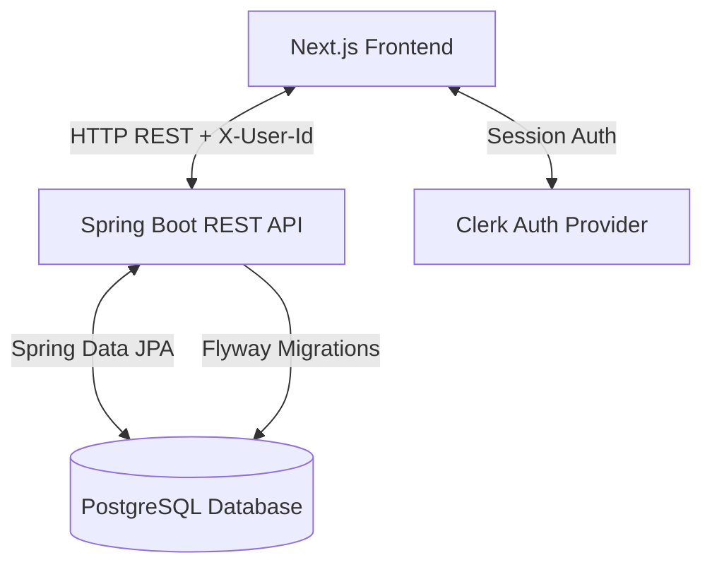

# 🪐 Lumina Edge

> **Lumina Edge** is an open-source, self-hosted personal productivity, finance, health, and activity-tracking dashboard designed for developers and power users. It provides absolute privacy and data isolation with a unified, state-of-the-art UI.

---

## 🏛️ System Architecture

Lumina Edge is designed with a modern decoupled, multi-tenant architectural style. By separation of concerns, the application splits the presentation layer from the core business logic.



### 1. Frontend: Presentation & Telemetry (Next.js)
* **Framework**: React / Next.js (App Router) with full TypeScript integration.
* **Aesthetics**: Harmony-focused dark themes, custom CSS tokens, premium glassmorphism, responsive design, and smooth transitions.
* **Authentication**: Managed via **Clerk Integration**. Tenant context is resolved dynamically on the client and appended to downstream REST calls.
* **Interaction Telemetry**: A built-in client-side tracker (`ActivityTracker.tsx`) hooks into window click events and page transitions. Events are buffered locally and flushed periodically to minimize API roundtrips.

### 2. Backend: Service Engine (Spring Boot)
* **Framework**: Java 17 / Spring Boot 3.x.
* **Database Access**: Spring Data JPA with Hibernate.
* **Database Migrations**: Flyway coordinates sequential, version-controlled SQL schema updates (located in `/db/migration`).
* **Multi-Tenant Isolation**: Data isolation is enforced at the database level. Domain models contain a `userId` attribute. Incoming REST requests require an `X-User-Id` header, which is passed down through controllers, services, and queries to ensure users only access their own data.

### 3. Database: Storage Layer (PostgreSQL)
* PostgreSQL 15 stores user-specific records across financial transaction tables, workout metrics, nutrition history, scheduled events, and system logs.

---

## 🛠️ Technology Stack

| Layer | Technology | Key Modules Used |
| :--- | :--- | :--- |
| **Frontend** | Next.js 14+ | React hooks, Context API, dynamic styling, responsive grid system |
| **Backend** | Spring Boot | Spring Web, Spring Data JPA, Hibernate, Lombok |
| **Database** | PostgreSQL | Native SQL, UUID key generators, indexing on search criteria |
| **Auth** | Clerk | Next.js Middleware, SDK, session hooks |
| **Migration**| Flyway | Automatic database schema versioning |
| **Container**| Docker | Multi-stage Dockerfiles, Docker Compose |

---

## 📦 Directory Structure

```text
Project--root1/
├── backend/
│   ├── src/main/java/com/lumina/
│   │   ├── config/             # CORS, Security, Web configuration
│   │   ├── controller/         # REST Controllers (Finance, Health, Time, Activity, Admin)
│   │   ├── dto/                # Data Transfer Objects
│   │   ├── entity/             # JPA Entity Definitions
│   │   ├── repository/         # JPA Repository Interfaces
│   │   └── service/            # Business Logic Layers
│   └── src/main/resources/
│       ├── application.properties
│       └── db/migration/       # Flyway SQL migrations (V1__ to V4__)
├── frontend/
│   ├── src/
│   │   ├── app/                # App router pages (Overview, Finance, Health, Schedule, Admin)
│   │   ├── components/         # Global shared components (Sidebar, ActivityTracker, Guards)
│   │   ├── context/            # Global UI and state contexts
│   │   ├── hooks/              # Custom React Hooks (useApi for data fetching)
│   │   └── lib/                # API wrappers and utilities
│   └── public/                 # Static assets
└── docker-compose.yml          # Local orchestration setup
```

---

## 🚀 Quickstart & Local Setup

### Prerequisites
Make sure you have the following installed on your machine:
* [Docker & Docker Compose](https://www.docker.com/)
* A [Clerk Account](https://clerk.com/) (Free Tier)

### 1. Environment Configurations
Clone the repository and copy the example environment template:
```bash
cp .env.example .env
```

Open `.env` and configure your credentials:
```env
# Database Settings
POSTGRES_DB=lumina_edge
POSTGRES_USER=lumina
POSTGRES_PASSWORD=securepassword

# Clerk Credentials (retrieve these from the Clerk Dashboard)
NEXT_PUBLIC_CLERK_PUBLISHABLE_KEY=pk_test_...
CLERK_SECRET_KEY=sk_test_...

# API Gateway Endpoint
NEXT_PUBLIC_API_URL=http://localhost:8080/api/v1
```

### 2. Spinning Up the Containers
Build and run the entire ecosystem locally using Docker Compose:
```bash
docker compose up -d --build
```
This single command spins up:
* **PostgreSQL** on port `5433` (externally) / `5432` (internally).
* **Spring Boot Backend** on port `8080`.
* **Next.js Frontend** on port `3000`.

### 3. Verification
* Open your browser and navigate to `http://localhost:3000`.
* Verify that Flyway successfully migrates the database schema on backend initialization.
* Logs can be checked using:
  ```bash
  docker compose logs -f backend
  ```

---

## 🔒 Security & Data Scoping

Lumina Edge implements strict security controls to prevent data exposure between accounts:

* **API Scoping**: Every write and read transaction passes through a security boundary. The frontend fetches the user context from Clerk, and injects the user's unique identifier into the `X-User-Id` header:
  ```typescript
  // Example frontend API call using useFetch
  const { data } = useFetch('/finance/transactions'); 
  // Custom hook automatically appends 'X-User-Id' to headers
  ```
* **Backend Isolation**: Controllers retrieve this header and explicitly propagate it to the service layers. Standard JPA repository calls are dynamically filtered using queries such as `findByUserId()` rather than unrestricted database pulls.
* **Log Safety**: Docker Compose configuration contains log limits (`max-size: "10m"`, `max-file: "3"`) to prevent logging bloat on self-hosted environments.

---

## 👑 Admin Control Panel

Admin features are restricted to the primary developer email: `jaiprakashray747@gmail.com`.
The panel allows:
1. **User Management**: Creating/Inviting users, suspending/activating accounts dynamically.
2. **Platform Metrics**: View transaction aggregates, system-wide scheduled events, and active workouts.
3. **Usage Analytics**: Real-time counters showing interaction analytics, nutrition logs, and active events mapped across the platform.

---

## 🤝 Contributing Guidelines

We welcome contributions from open-source developers! Here is how you can help:

1. **Bug Fixes & Security**: Help us replace header-based `X-User-Id` scoping with verified Clerk JWT verification in the backend Spring Security filter chain for enterprise deployments.
2. **Additional Trackers**: Build out modules for tracking habits, books, and projects.
3. **Docker Improvements**: Optimize builds or configure Kubernetes Helm charts.

### Steps to contribute:
1. Fork the project.
2. Create your Feature Branch (`git checkout -b feature/AmazingFeature`).
3. Commit your changes (`git commit -m 'Add some AmazingFeature'`).
4. Push to the Branch (`git push origin feature/AmazingFeature`).
5. Open a Pull Request.

---

## 📄 License
This project is open-source and licensed under the MIT License.
